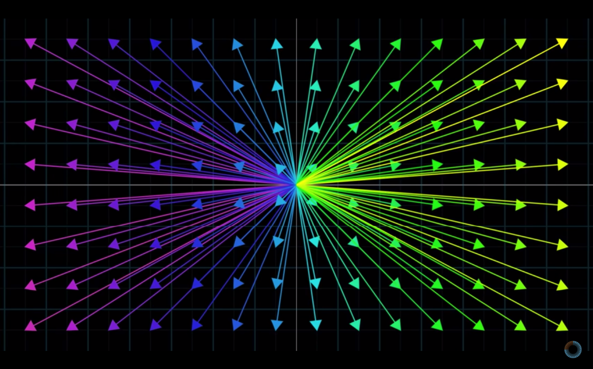
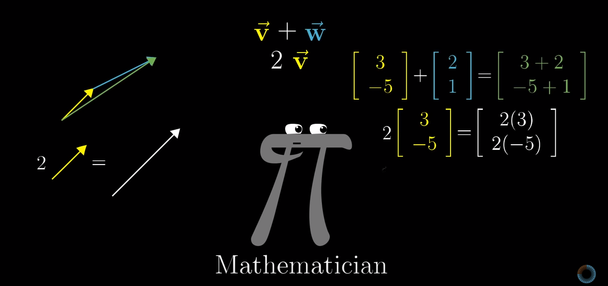

# Linear Algebra
[(Return back to Contents)](https://github.com/rchavezj/Cracking_The_Machine_Learning_Interview/#Contents)

### 1. What is broadcasting in connection to Linear Algebra?
### 2. What are scalars, vectors, matrices, and tensors?
Vectors, at least for computer scientist, is commonly used as a list of different dimensions. Each row from one column represents the number of training examples.  
Scalers are numerical values to stretch, squeeze, or even change to the opposite direction of a given vector 
Matrices are similar to vectors except each column is another set of features for the dataset.  
### 3. What is Hadamard product of two matrices?
### 4. What is an inverse matrix?
### 5. If inverse of a matrix exists, how to calculate it?
### 6. What is the determinant of a square matrix? How is it calculated? What is the connection of determinant to eigenvalues?
> 
### 7. Discuss span and linear dependence.
### 8. What is Ax = b? When does Ax =b has a unique solution?
### 9. In Ax = b, what happens when A is fat or tall?
### 10. When does inverse of A exist?
### 11. What is a norm? What is L1, L2 and L infinity norm?
### 12. What are the conditions a norm has to satisfy?
### 13. Why is squared of L2 norm preferred in ML than just L2 norm?
### 14. When L1 norm is preferred over L2 norm?
### 15. Can the number of nonzero elements in a vector be defined as L0 norm? If no, why?
### 16. What is Frobenius norm?
### 17. What is a diagonal matrix?
### 18. Why is multiplication by diagonal matrix computationally cheap? How is the multiplication different for square vs. non-square diagonal matrix?
### 19. At what conditions does the inverse of a diagonal matrix exist?
### 20. What is a symmetrix matrix?
### 21. What is a unit vector?
### 22. When are two vectors x and y orthogonal?
### 23. At R^n what is the maximum possible number of orthogonal vectors with non-zero norm?
### 24. When are two vectors x and y orthonormal?
### 25. What is an orthogonal matrix? Why is computationally preferred?
### 26. What is eigendecomposition, eigenvectors and eigenvalues?
### 27. How to find eigen values of a matrix?
### 28. Write the eigendecomposition formula for a matrix. If the matrix is real symmetric, how will this change?
### 29. Is the Eigendecomposition guaranteed to be unique? If not, then how do we represent it?
### 30. What are positive definite, negative definite, positive semi definite and negative semi definite matrices?
### 31. What is Singular Value Decomposition? Why do we use it? Why not just use ED?
### 32. Given a matrix A, how will you calculate its Singular Value Decomposition?
### 33. What are singular values, left singulars and right singulars?
### 34. What is the connection of Singular Value Decomposition of A with functions of A?
### 35. Why are singular values always non-negative?
### 36. What is the Moore Penrose pseudo inverse and how to calculate it?
### 37. If we do Moore Penrose pseudo inverse on Ax = b, what solution is provided is A is fat? Moreover, what solution is provided if A is tall?
### 38. Which matrices can be decomposed by ED?
### 39. Which matrices can be decomposed by SVD?
### 40. What is the trace of a matrix?
### 41. How to write Frobenius norm of a matrix A in terms of trace?
### 42. Why is trace of a multiplication of matrices invariant to cyclic permutations?
### 43. What is the trace of a scalar?
### 44. Write the frobenius norm of a matrix in terms of trace?
