# Solutions on Cracking The Machine Learning Interview
### -------> Currently under construction! <-------
Solutions from the Medium article "Cracking the Machine Learning Interview". Subhrajit, the author from the article, has only written down questions and no update on the solutions in the past year. I plan on finishing the war. 
https://medium.com/subhrajit-roy/cracking-the-machine-learning-interview-1d8c5bb752d8

# Contents:
|                        |                                          |
| ---------------------- | ---------------------------------------- |
| 1. [Linear Algebra](#Linear-Algebra)                         | 2. [Numerical Optimization](#Numerical-Optimization)                                         |
| 3. [Basics of Probability and Information Theory](#Basics-of-Probability-and-Information-Theory)                                                                                                        |  4. [Confidence Interval](#Confidence-Interval)|
| 5. [Learning Theory](#Learning-Theory)                       |  6. [Model and Feature Selection](#Model-and-Feature-Selection) |
| 7. [Curse of dimensionality](#Curse-of-Dimensionality)       |  8. [Universal approximation of neural networks](#Universal-Approximation-of-Neural-Networks) |
| 9. [Deep Learning motivation](#Deep-Learning-Motivation)     |  10. [Support Vector Machine](#Support-Vector-Machine) |
| 11. [Bayesian Machine Learning](#Bayesian-Machine-Learning)  |  12. [Regularization](#Regularization) |
| 13. [Evaluation of Machine Learning systems](#Evaluation-of-Machine-Learning-Systems) |  14. [Clustering](#Clustering)  |
| 15. [Dimensionality Reduction](#Dimensionality-Reduction)    |  16. [Basics of Natural Language Processing](#Basics-of-Natural-Language-Processing) |
| 17. [Some basic questions](#Some-basic-questions)            |  18. [Optimization Procedures](#Optimization-Procedures) |
| 19. [Sequence Modeling](#Sequence-Modeling)                  |  20. [Autoencoders](#Autoencoders)               |
| 21. [Representation Learning](#Representation-Learning)      |  22. [Monte Carlo Methods](#Monte-Carlo-Methods) |

### [Linear Algebra](01_Linear_Algebra/#Linear-Algebra)
[(Return back to Contents)](#Contents)

1. What is broadcasting in connection to Linear Algebra?
2. [What are scalars, vectors, matrices, and tensors?](#01_Linear_Algebra/2.-What-are-scalars,-vectors,-matrices,-and-tensors?)
3. What is Hadamard product of two matrices?
4. What is an inverse matrix?
5. If inverse of a matrix exists, how to calculate it?
6. What is the determinant of a square matrix? How is it calculated? What is the connection of determinant to eigenvalues?
7. Discuss span and linear dependence.
8. What is Ax = b? When does Ax =b has a unique solution?
9. In Ax = b, what happens when A is fat or tall?
10. When does inverse of A exist?
11. What is a norm? What is L1, L2 and L infinity norm?
12. What are the conditions a norm has to satisfy?
13. Why is squared of L2 norm preferred in ML than just L2 norm?
14. When L1 norm is preferred over L2 norm?
15. Can the number of nonzero elements in a vector be defined as L0 norm? If no, why?
16. What is Frobenius norm?
17. What is a diagonal matrix?
18. Why is multiplication by diagonal matrix computationally cheap? How is the multiplication different for square vs. non-square diagonal matrix?
19. At what conditions does the inverse of a diagonal matrix exist?
20. What is a symmetrix matrix?
21. What is a unit vector?
22. When are two vectors x and y orthogonal?
23. At R^n what is the maximum possible number of orthogonal vectors with non-zero norm?
24. When are two vectors x and y orthonormal?
25. What is an orthogonal matrix? Why is computationally preferred?
26. What is eigendecomposition, eigenvectors and eigenvalues?
27. How to find eigen values of a matrix?
28. Write the eigendecomposition formula for a matrix. If the matrix is real symmetric, how will this change?
29. Is the Eigendecomposition guaranteed to be unique? If not, then how do we represent it?
30. What are positive definite, negative definite, positive semi definite and negative semi definite matrices?
31. What is Singular Value Decomposition? Why do we use it? Why not just use ED?
32. Given a matrix A, how will you calculate its Singular Value Decomposition?
33. What are singular values, left singulars and right singulars?
34. What is the connection of Singular Value Decomposition of A with functions of A?
35. Why are singular values always non-negative?
36. What is the Moore Penrose pseudo inverse and how to calculate it?
37. If we do Moore Penrose pseudo inverse on Ax = b, what solution is provided is A is fat? Moreover, what solution is provided if A is tall?
38. Which matrices can be decomposed by ED?
39. Which matrices can be decomposed by SVD?
40. What is the trace of a matrix?
41. How to write Frobenius norm of a matrix A in terms of trace?
42. Why is trace of a multiplication of matrices invariant to cyclic permutations?
43. What is the trace of a scalar?
44. Write the frobenius norm of a matrix in terms of trace?

### Numerical Optimization
[(Return back to Contents)](#Contents)

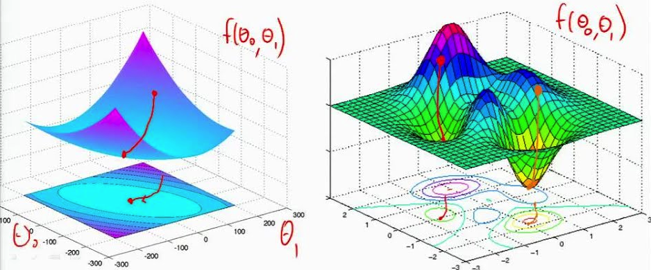

1. What is underflow and overflow?
2. How to tackle the problem of underflow or overflow for softmax function or log softmax function?
3. What is poor conditioning?
4. What is the condition number?
5. What are grad, div and curl?
6. What are critical or stationary points in multi-dimensions?
7. Why should you do gradient descent when you want to minimize a function?
8. What is line search?
9. What is hill climbing?
10. What is a Jacobian matrix?
11. What is curvature?
12. What is a Hessian matrix?

### Basics of Probability and Information Theory
[(Return back to Contents)](#Contents)

1. Compare “Frequentist probability” vs. “Bayesian probability”?
2. What is a random variable?
3. What is a probability distribution?
4. What is a probability mass function?
5. What is a probability density function?
6. What is a joint probability distribution?
7. What are the conditions for a function to be a probability mass function?
8. What are the conditions for a function to be a probability density function?
9. What is a marginal probability? Given the joint probability function, how will you calculate it?
10. What is conditional probability? Given the joint probability function, how will you calculate it?
11. State the Chain rule of conditional probabilities.
12. What are the conditions for independence and conditional independence of two random variables?
13. What are expectation, variance and covariance?
14. Compare covariance and independence.
15. What is the covariance for a vector of random variables?
16. What is a Bernoulli distribution? Calculate the expectation and variance of a random variable that follows Bernoulli distribution?
17. What is a multinoulli distribution?
18. What is a normal distribution?
19. Why is the normal distribution a default choice for a prior over a set of real numbers?
20. What is the central limit theorem?
21. What are exponential and Laplace distribution?
22. What are Dirac distribution and Empirical distribution?
23. What is mixture of distributions?
24. Name two common examples of mixture of distributions? (Empirical and Gaussian Mixture)
25. Is Gaussian mixture model a universal approximator of densities?
26. Write the formulae for logistic and softplus function.
27. Write the formulae for Bayes rule.
28. What do you mean by measure zero and almost everywhere?
29. If two random variables are related in a deterministic way, how are the PDFs related?
30. Define self-information. What are its units?
31. What are Shannon entropy and differential entropy?
32. What is Kullback-Leibler (KL) divergence?
33. Can KL divergence be used as a distance measure?
34. Define cross-entropy.
35. What are structured probabilistic models or graphical models?
36. In the context of structured probabilistic models, what are directed and undirected models? How are they represented? What are cliques in undirected structured probabilistic models?

### Confidence interval 
[(Return back to Contents)](#Contents)

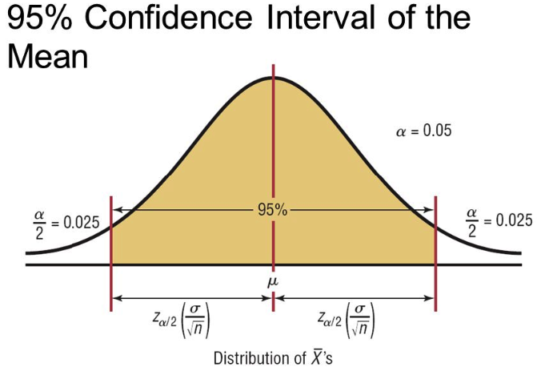

1. What is population mean and sample mean?
2. What is population standard deviation and sample standard deviation?
3. Why population s.d. has N degrees of freedom while sample s.d. has N-1 degrees of freedom? In other words, why 1/N inside root for pop. s.d. and 1/(N-1) inside root for sample s.d.?
4. What is the formula for calculating the s.d. of the sample mean?
5. What is confidence interval?
6. What is standard error?

### Learning Theory 
[(Return back to Contents)](#Contents)

1. Describe bias and variance with examples.
2. What is Empirical Risk Minimization?
3. What is Union bound and Hoeffding’s inequality?
4. Write the formulae for training error and generalization error. Point out the differences.
5. State the uniform convergence theorem and derive it.
6. What is sample complexity bound of uniform convergence theorem?
7. What is error bound of uniform convergence theorem?
8. What is the bias-variance trade-off theorem?
9. From the bias-variance trade-off, can you derive the bound on training set size?
10. What is the VC dimension?
11. What does the training set size depend on for a finite and infinite hypothesis set? Compare and contrast.
12. What is the VC dimension for an n-dimensional linear classifier?
13. How is the VC dimension of a SVM bounded although it is projected to an infinite dimension?
14. Considering that Empirical Risk Minimization is a NP-hard problem, how does logistic regression and SVM loss work?

### Model and feature selection
[(Return back to Contents)](#Contents)

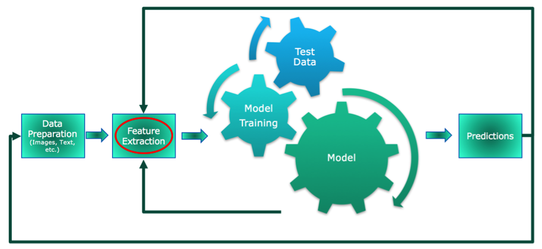

1. Why are model selection methods needed?
2. How do you do a trade-off between bias and variance?
3. What are the different attributes that can be selected by model selection methods?
4. Why is cross-validation required?
5. Describe different cross-validation techniques.
6. What is hold-out cross validation? What are its advantages and disadvantages?
7. What is k-fold cross validation? What are its advantages and disadvantages?
8. What is leave-one-out cross validation? What are its advantages and disadvantages?
9. Why is feature selection required?
10. Describe some feature selection methods.
11. What is forward feature selection method? What are its advantages and disadvantages?
12. What is backward feature selection method? What are its advantages and disadvantages?
13. What is filter feature selection method and describe two of them?
14. What is mutual information and KL divergence?
15. Describe KL divergence intuitively.

### Curse of dimensionality
[(Return back to Contents)](#Contents)

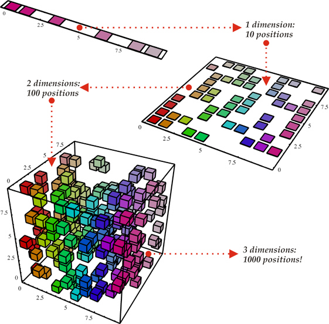

1. Describe the curse of dimensionality with examples.
2. What is local constancy or smoothness prior or regularization?

### Universal approximation of neural networks
[(Return back to Contents)](#Contents)

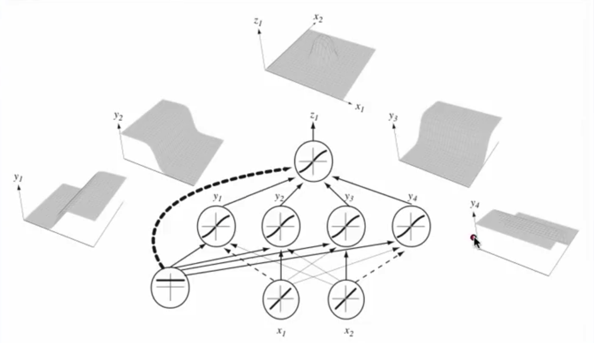

1. State the universal approximation theorem? What is the technique used to prove that?
2. What is a Borel measurable function?
3. Given the universal approximation theorem, why can’t a Multi Layer Perceptron (MLP) still reach an arbitrarily small positive error?

### Deep Learning motivation
[(Return back to Contents)](#Contents)

1. What is the mathematical motivation of Deep Learning as opposed to standard Machine Learning techniques?
2. In standard Machine Learning vs. Deep Learning, how is the order of number of samples related to the order of regions that can be 3. recognized in the function space?
3. What are the reasons for choosing a deep model as opposed to shallow model?
4. How Deep Learning tackles the curse of dimensionality?

### Support Vector Machine
[(Return back to Contents)](#Contents)

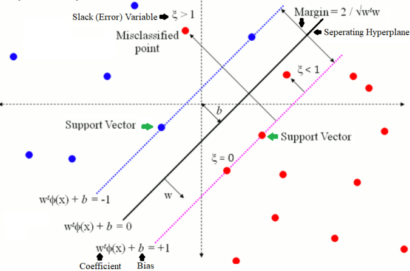

1. How can the SVM optimization function be derived from the logistic regression optimization function?
2. What is a large margin classifier?
3. Why SVM is an example of a large margin classifier?
4. SVM being a large margin classifier, is it influenced by outliers?
5. What is the role of C in SVM?
6. In SVM, what is the angle between the decision boundary and theta?
7. What is the mathematical intuition of a large margin classifier?
8. What is a kernel in SVM? Why do we use kernels in SVM?
9. What is a similarity function in SVM? Why it is named so?
10. How are the landmarks initially chosen in an SVM? How many and where?
11. Can we apply the kernel trick to logistic regression? Why is it not used in practice then?
12. What is the difference between logistic regression and SVM without a kernel?
13. How does the SVM parameter C affect the bias/variance trade off?
14. How does the SVM kernel parameter sigma² affect the bias/variance trade off?
15. Can any similarity function be used for SVM?
16. Logistic regression vs. SVMs: When to use which one?

### Bayesian Machine Learning
[(Return back to Contents)](#Contents)

1. What are the differences between “Bayesian” and “Freqentist” approach for Machine Learning?
2. Compare and contrast maximum likelihood and maximum a posteriori estimation.
3. How does Bayesian methods do automatic feature selection?
4. What do you mean by Bayesian regularization?
5. When will you use Bayesian methods instead of Frequentist methods?

### Regularization
[(Return back to Contents)](#Contents)

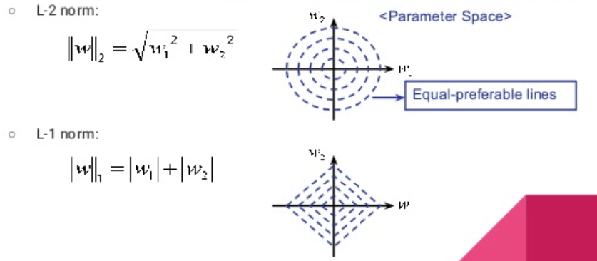

1. What is L1 regularization?
2. What is L2 regularization?
3. Compare L1 and L2 regularization.
4. Why does L1 regularization result in sparse models?
5. What is dropout?
6. How will you implement dropout during forward and backward pass?

### Evaluation of Machine Learning systems
[(Return back to Contents)](#Contents)

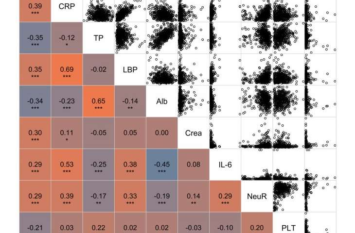

1. What are accuracy, sensitivity, specificity, ROC?
2. What are precision and recall?
3. Describe t-test in the context of Machine Learning.

### Clustering
[(Return back to Contents)](#Contents)

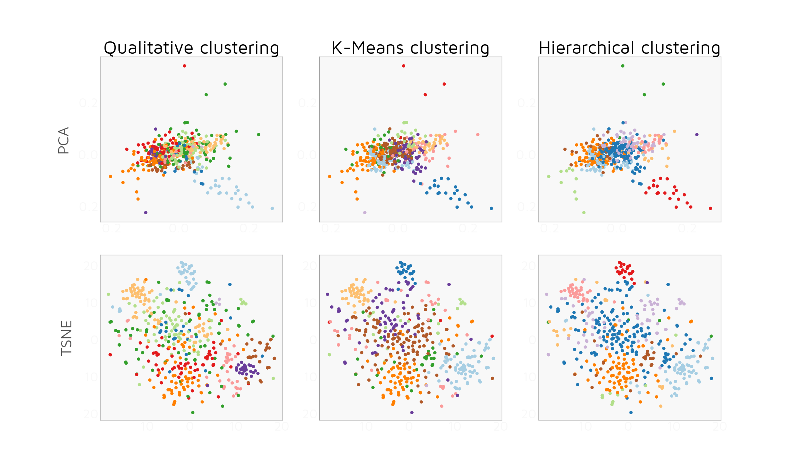

1. Describe the k-means algorithm.
2. What is distortion function? Is it convex or non-convex?
3. Tell me about the convergence of the distortion function.
4. Topic: EM algorithm
5. What is the Gaussian Mixture Model?
6. Describe the EM algorithm intuitively.
7. What are the two steps of the EM algorithm
8. Compare Gaussian Mixture Model and Gaussian Discriminant Analysis.

### Dimensionality Reduction
[(Return back to Contents)](#Contents)

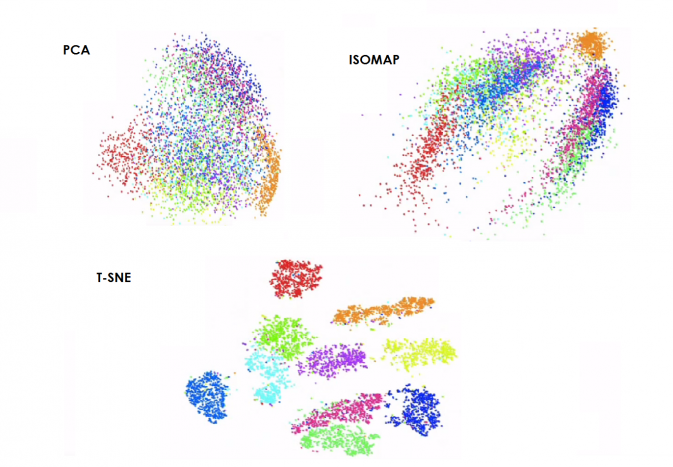

1. Why do we need dimensionality reduction techniques?
2. What do we need PCA and what does it do?
3. What is the difference between logistic regression and PCA?
4. What are the two pre-processing steps that should be applied before doing PCA?

### Basics of Natural Language Processing
[(Return back to Contents)](#Contents)

1. What is WORD2VEC?
2. What is t-SNE? Why do we use PCA instead of t-SNE?
3. What is sampled softmax?
4. Why is it difficult to train a RNN with SGD?
5. How do you tackle the problem of exploding gradients?
6. What is the problem of vanishing gradients?
7. How do you tackle the problem of vanishing gradients?
8. Explain the memory cell of a LSTM.
9. What type of regularization do one use in LSTM?
10. What is Beam Search?
11. How to automatically caption an image?

### Some basic questions
[(Return back to Contents)](#Contents)

1. Can you state Tom Mitchell’s definition of learning and discuss T, P and E?
2. What can be different types of tasks encountered in Machine Learning?
3. What are supervised, unsupervised, semi-supervised, self-supervised, multi-instance learning, and reinforcement learning?
4. Loosely how can supervised learning be converted into unsupervised learning and vice-versa?
5. Consider linear regression. What are T, P and E?
6. Derive the normal equation for linear regression.
7. What do you mean by affine transformation? Discuss affine vs. linear transformation.
8. Discuss training error, test error, generalization error, overfitting, and underfitting.
9. Compare representational capacity vs. effective capacity of a model.
Discuss VC dimension.
10. What are nonparametric models? What is nonparametric learning?
11. What is an ideal model? What is Bayes error? What is/are the source(s) of Bayes error occur?
12. What is the no free lunch theorem in connection to Machine Learning?
13. What is regularization? Intuitively, what does regularization do during the optimization procedure?
14. What is weight decay? What is it added?
15. What is a hyperparameter? How do you choose which settings are going to be hyperparameters and which are going to be learned?
16. Why is a validation set necessary?
17. What are the different types of cross-validation? When do you use which one?
18. What are point estimation and function estimation in the context of Machine Learning? What is the relation between them?
19. What is the maximal likelihood of a parameter vector $theta$? Where does the log come from?
20. Prove that for linear regression MSE can be derived from maximal likelihood by proper assumptions.
21. Why is maximal likelihood the preferred estimator in ML?
22. Under what conditions do the maximal likelihood estimator guarantee consistency?
23. What is cross-entropy of loss?
24. What is the difference between loss function, cost function and objective function?

### Optimization procedures
[(Return back to Contents)](#Contents)

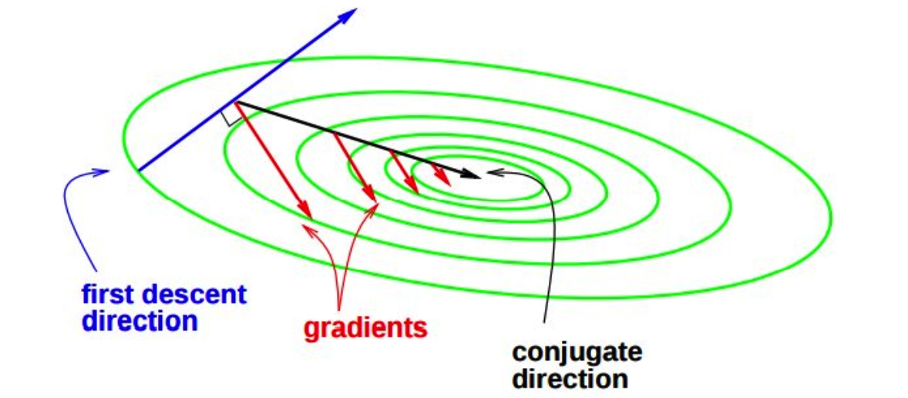

1. What is the difference between an optimization problem and a Machine Learning problem?
2. How can a learning problem be converted into an optimization problem?
3. What is empirical risk minimization? Why the term empirical? Why do we rarely use it in the context of deep learning?
4. Name some typical loss functions used for regression. Compare and contrast.
5. What is the 0–1 loss function? Why can’t the 0–1 loss function or classification error be used as a loss function for optimizing a deep neural network?

### Sequence Modeling
[(Return back to Contents)](#Contents)

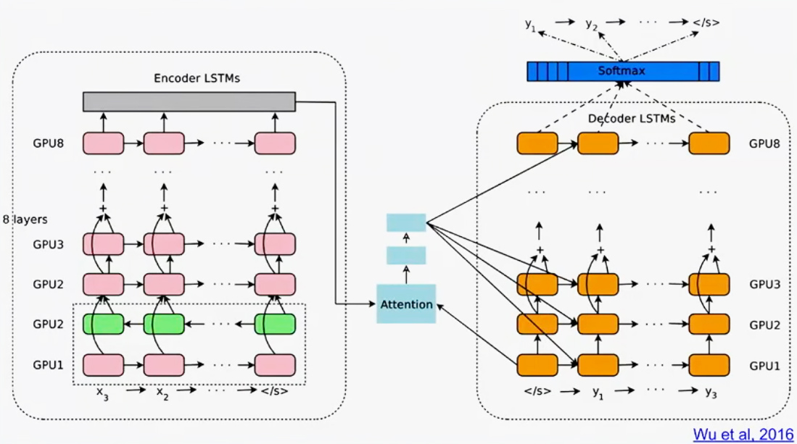

1. Write the equation describing a dynamical system. Can you unfold it? Now, can you use this to describe a RNN?
2. What determines the size of an unfolded graph?
3. What are the advantages of an unfolded graph?
4. What does the output of the hidden layer of a RNN at any arbitrary time t represent?
5. Are the output of hidden layers of RNNs lossless? If not, why?
6. RNNs are used for various tasks. From a RNNs point of view, what tasks are more demanding than others?
7. Discuss some examples of important design patterns of classical RNNs.
8. Write the equations for a classical RNN where hidden layer has recurrence. How would you define the loss in this case? What problems you might face while training it?
9. What is backpropagation through time?
10. Consider a RNN that has only output to hidden layer recurrence. What are its advantages or disadvantages compared to a RNN having only hidden to hidden recurrence?
11. What is Teacher forcing? Compare and contrast with BPTT.
12. What is the disadvantage of using a strict teacher forcing technique? How to solve this?
13. Explain the vanishing/exploding gradient phenomenon for recurrent neural networks.
14. Why don’t we see the vanishing/exploding gradient phenomenon in feedforward networks?
15. What is the key difference in architecture of LSTMs/GRUs compared to traditional RNNs?
16. What is the difference between LSTM and GRU?
17. Explain Gradient Clipping.
18. Adam and RMSProp adjust the size of gradients based on previously seen gradients. Do they inherently perform gradient clipping? If no, why?
19. Discuss RNNs in the context of Bayesian Machine Learning.
20. Can we do Batch Normalization in RNNs? If not, what is the alternative?

### Autoencoders
[(Return back to Contents)](#Contents)

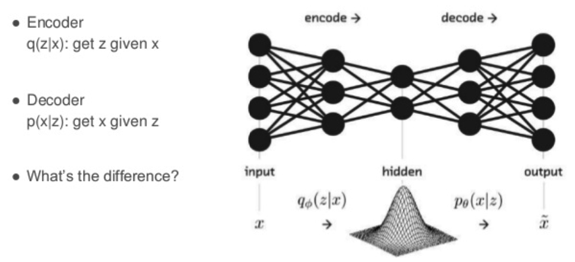

1. What is an Autoencoder? What does it “auto-encode”?
2. What were Autoencoders traditionally used for? Why there has been a resurgence of Autoencoders for generative modeling?
3. What is recirculation?
4. What loss functions are used for Autoencoders?
5. What is a linear autoencoder? Can it be optimal (lowest training reconstruction error)? If yes, under what conditions?
6. What is the difference between Autoencoders and PCA?
7. What is the impact of the size of the hidden layer in Autoencoders?
8. What is an undercomplete Autoencoder? Why is it typically used for?
9. What is a linear Autoencoder? Discuss it’s equivalence with PCA. Which one is better in reconstruction?
10. What problems might a nonlinear undercomplete Autoencoder face?
11. What are overcomplete Autoencoders? What problems might they face? Does the scenario change for linear overcomplete autoencoders?
12. Discuss the importance of regularization in the context of Autoencoders.
13. Why does generative autoencoders not require regularization?
14. What are sparse autoencoders?
15. What is a denoising autoencoder? What are its advantages? How does it solve the overcomplete problem?
16. What is score matching? Discuss it’s connections to DAEs.
17. Are there any connections between Autoencoders and RBMs?
18. What is manifold learning? How are denoising and contractive autoencoders equipped to do manifold learning?
19. What is a contractive autoencoder? Discuss its advantages. How does it solve the overcomplete problem?
20. Why is a contractive autoencoder named so?
21. What are the practical issues with CAEs? How to tackle them?
22. What is a stacked autoencoder? What is a deep autoencoder? Compare and contrast.
23. Compare the reconstruction quality of a deep autoencoder vs. PCA.
24. What is predictive sparse decomposition?
25. Discuss some applications of Autoencoders.

### Representation Learning
[(Return back to Contents)](#Contents)

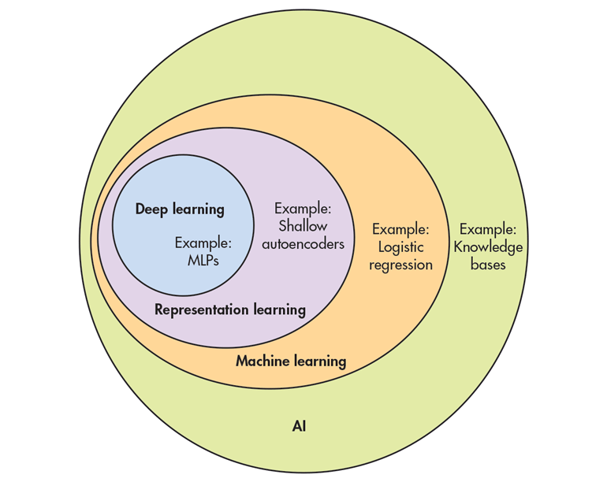

1. What is representation learning? Why is it useful?
2. What is the relation between Representation Learning and Deep Learning?
3. What is one-shot and zero-shot learning (Google’s NMT)? Give examples.
4. What trade offs does representation learning have to consider?
5. What is greedy layer-wise unsupervised pretraining (GLUP)? Why greedy? Why layer-wise? Why unsupervised? Why pretraining?
6. What were/are the purposes of the above technique? (deep learning problem and initialization)
7. Why does unsupervised pretraining work?
8. When does unsupervised training work? Under which circumstances?
9. Why might unsupervised pretraining act as a regularizer?
10. What is the disadvantage of unsupervised pretraining compared to other forms of unsupervised learning?
11. How do you control the regularizing effect of unsupervised pretraining?
12. How to select the hyperparameters of each stage of GLUP?

### Monte Carlo Methods
[(Return back to Contents)](#Contents)

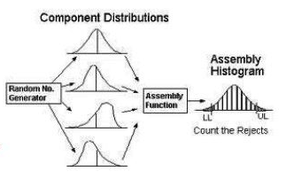

1. What are deterministic algorithms?
2. What are Las vegas algorithms?
3. What are deterministic approximate algorithms?
4. What are Monte Carlo algorithms?

