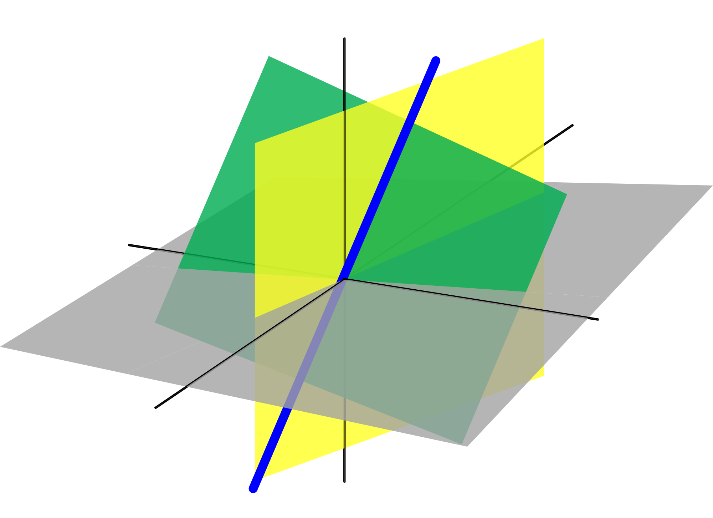
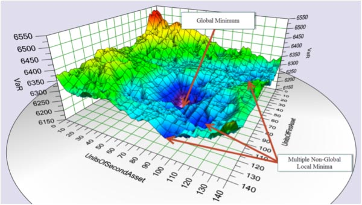
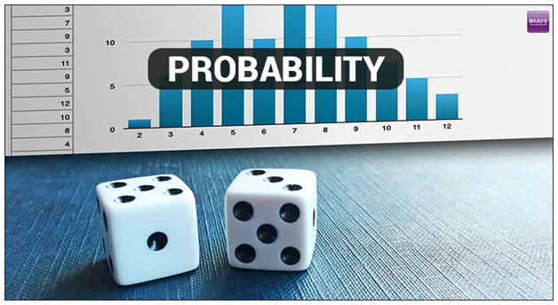

# Cracking The Machine Learning Interview
### -------> Currently under construction! <-------
Solutions from the Medium article "Cracking the Machine Learning Interview" written by Subhrajit Roy
https://medium.com/subhrajit-roy/cracking-the-machine-learning-interview-1d8c5bb752d8

# Contents:
|                        |                                          |
| ---------------------- | ---------------------------------------- |
| 1. [Linear Algebra](#Linear-Algebra)                         | 2. [Numerical Optimization](#Numerical-Optimization)                                         |
| 3. [Basics of Probability and Information Theory](#Basics-of-Probability-and-Information-Theory)                                                                                                        |  4. [Confidence Interval](#Confidence-Interval)|
| 5. [Learning Theory](#Learning-Theory)                       |  6. [Model and Feature Selection](#Model-and-Feature-Selection) |
| 7. [Curse of dimensionality](#Curse-of-Dimensionality)       |  8. [Universal approximation of neural networks](#Universal-Approximation-of-Neural-Networks) |
| 9. [Deep Learning motivation](#Deep-Learning-Motivation)     |  10. [Support Vector Machine](#Support-Vector-Machine) |
| 11. [Bayesian Machine Learning](#Bayesian-Machine-Learning)  |  12. [Regularization](#Regularization) |
| 13. [Evaluation of Machine Learning systems](#Evaluation-of-Machine-Learning-Systems) |  14. [Clustering](#Clustering)  |
| 15. [Dimensionality Reduction](#Dimensionality-Reduction)    |  16. [Basics of Natural Language Processing](#Basics-of-Natural-Language-Processing) |
| 17. [Some basic questions](#Some-basic-questions)            |  18. [Optimization Procedures](#Optimization-Procedures) |
| 19. [Sequence Modeling](#Sequence-Modeling)                  |  20. [Autoencoders](#Autoencoders)               |
| 21. [Representation Learning](#Representation-Learning)      |  22. [Monte Carlo Methods](#Monte-Carlo-Methods) |

### Linear Algebra

1. What is broadcasting in connection to Linear Algebra?
2. What are scalars, vectors, matrices, and tensors?
3. What is Hadamard product of two matrices?
4. What is an inverse matrix?
5. If inverse of a matrix exists, how to calculate it?
6. What is the determinant of a square matrix? How is it calculated? What is the connection of determinant to eigenvalues?
7. Discuss span and linear dependence.
8. What is Ax = b? When does Ax =b has a unique solution?
9. In Ax = b, what happens when A is fat or tall?
10. When does inverse of A exist?
11. What is a norm? What is L1, L2 and L infinity norm?
12. What are the conditions a norm has to satisfy?
13. Why is squared of L2 norm preferred in ML than just L2 norm?
14. When L1 norm is preferred over L2 norm?
15. Can the number of nonzero elements in a vector be defined as L0 norm? If no, why?
16. What is Frobenius norm?
17. What is a diagonal matrix?
18. Why is multiplication by diagonal matrix computationally cheap? How is the multiplication different for square vs. non-square diagonal matrix?
19. At what conditions does the inverse of a diagonal matrix exist?
20. What is a symmetrix matrix?
21. What is a unit vector?
22. When are two vectors x and y orthogonal?
23. At R^n what is the maximum possible number of orthogonal vectors with non-zero norm?
24. When are two vectors x and y orthonormal?
25. What is an orthogonal matrix? Why is computationally preferred?
26. What is eigendecomposition, eigenvectors and eigenvalues?
27. How to find eigen values of a matrix?
28. Write the eigendecomposition formula for a matrix. If the matrix is real symmetric, how will this change?
29. Is the Eigendecomposition guaranteed to be unique? If not, then how do we represent it?
30. What are positive definite, negative definite, positive semi definite and negative semi definite matrices?
31. What is Singular Value Decomposition? Why do we use it? Why not just use ED?
32. Given a matrix A, how will you calculate its Singular Value Decomposition?
33. What are singular values, left singulars and right singulars?
34. What is the connection of Singular Value Decomposition of A with functions of A?
35. Why are singular values always non-negative?
36. What is the Moore Penrose pseudo inverse and how to calculate it?
37. If we do Moore Penrose pseudo inverse on Ax = b, what solution is provided is A is fat? Moreover, what solution is provided if A is tall?
38. Which matrices can be decomposed by ED?
39. Which matrices can be decomposed by SVD?
40. What is the trace of a matrix?
41. How to write Frobenius norm of a matrix A in terms of trace?
42. Why is trace of a multiplication of matrices invariant to cyclic permutations?
43. What is the trace of a scalar?
44. Write the frobenius norm of a matrix in terms of trace?

### Numerical Optimization

1. What is underflow and overflow?
2. How to tackle the problem of underflow or overflow for softmax function or log softmax function?
3. What is poor conditioning?
4. What is the condition number?
5. What are grad, div and curl?
6. What are critical or stationary points in multi-dimensions?
7. Why should you do gradient descent when you want to minimize a function?
8. What is line search?
9. What is hill climbing?
10. What is a Jacobian matrix?
11. What is curvature?
12. What is a Hessian matrix?

### Basics of Probability and Information Theory

1. Compare “Frequentist probability” vs. “Bayesian probability”?
2. What is a random variable?
3. What is a probability distribution?
4. What is a probability mass function?
5. What is a probability density function?
6. What is a joint probability distribution?
7. What are the conditions for a function to be a probability mass function?
8. What are the conditions for a function to be a probability density function?
9. What is a marginal probability? Given the joint probability function, how will you calculate it?
10. What is conditional probability? Given the joint probability function, how will you calculate it?
11. State the Chain rule of conditional probabilities.
12. What are the conditions for independence and conditional independence of two random variables?
13. What are expectation, variance and covariance?
14. Compare covariance and independence.
15. What is the covariance for a vector of random variables?
16. What is a Bernoulli distribution? Calculate the expectation and variance of a random variable that follows Bernoulli distribution?
17. What is a multinoulli distribution?
18. What is a normal distribution?
19. Why is the normal distribution a default choice for a prior over a set of real numbers?
20. What is the central limit theorem?
21. What are exponential and Laplace distribution?
22. What are Dirac distribution and Empirical distribution?
23. What is mixture of distributions?
24. Name two common examples of mixture of distributions? (Empirical and Gaussian Mixture)
25. Is Gaussian mixture model a universal approximator of densities?
26. Write the formulae for logistic and softplus function.
27. Write the formulae for Bayes rule.
28. What do you mean by measure zero and almost everywhere?
29. If two random variables are related in a deterministic way, how are the PDFs related?
30. Define self-information. What are its units?
31. What are Shannon entropy and differential entropy?
32. What is Kullback-Leibler (KL) divergence?
33. Can KL divergence be used as a distance measure?
34. Define cross-entropy.
35. What are structured probabilistic models or graphical models?
36. In the context of structured probabilistic models, what are directed and undirected models? How are they represented? What are cliques in undirected structured probabilistic models?

